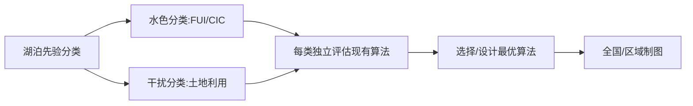

# 06.湖泊POC遥感反演方法：基于分类视角的文献综述

**生成日期**: 2026-06-02
**检索关键词**: lake particulate organic carbon (POC) remote sensing, POC inversion algorithm, lake optical classification, water type classification, optical water types, inland water POC retrieval, 湖泊颗粒有机碳遥感反演, 湖泊水色分类
**检索到文献数**: 7 篇核心文献 + 1 篇光学分类框架文献（均有全文可读）
**覆盖文献范围**: `KRZGW89V`, `RY3VXKA6`, `Q6FJUFRZ`, `SWB2W7SR`, `K6AZ2PQN`, `8NMCCIF7`, `DPJCU6E6`, `DRZJFTQ8`

---

## 一、筛选文献

当前Zotero文库中关于湖泊POC遥感反演的文献集中在2017–2025年，覆盖了从区域性经验算法到全国尺度分类反演、从二维表面浓度到三维垂向储量估算、从传统统计模型到深度学习的发展全貌。这些文献可按**方法论贡献**分为三个交叉群组：

**群组一：光学分类驱动的POC反演（核心群组）**。Xue et al. (2025, RSE)、Liu et al. (2024, Water Research) 和 Zhao et al. (2022, RSE) 三篇论文各自独立地提出了基于水体光学分类的POC反演框架。三者的共同认识是：POC本身不具光学活性，必须通过其与光学活性组分（叶绿素a、悬浮物）的相关性进行间接反演；而POC的多种来源（内源浮游植物、外源陆源输入）导致这种相关性在不同类型水体中差异显著，因此分类是提高反演精度的前提。三篇论文的差异在于分类依据不同——Xue et al. 用AFAI指数区分NAP主导型和浮游植物主导型水体，Liu et al. 用560 nm反射峰高度区分富营养型和贫营养型水体，Zhao et al. 则基于同位素示踪的内/外源POC比例（RendPOC ≥ 0.5 vs. < 0.5）进行分类。这种多元分类策略恰好为"从湖泊分类角度入手"提供了方法论基础。

**群组二：三维垂向拓展**。Liu et al. (2023, Water Research) 首次将POC遥感从表面浓度拓展到水柱积分储量，提出了基于垂向廓线类型分类（均匀型/指数衰减型/幂律衰减型）的过程导向方法。该研究清楚表明：表面POC浓度与储量之间的关系因廓线类型而异，而廓线类型又与水体状态（是否有水华、水深、风速）密切相关。

**群组三：机器学习方法**。Pan et al. (2023, Sustainability) 引入CNN-LSTM深度学习架构，利用Sentinel-2多光谱和时间序列信息反演巢湖POC。虽然该研究未采用显式水体分类，但其深度学习模型本质上在隐空间中对不同水体状态进行了非线性区分。

**群组四：光学分类基础框架**。Spyrakos et al. (2017, L&O) 基于4045条现场高光谱数据识别了13类内陆水体光学类型，为POC反演中的分类策略提供了谱系学基础。

**覆盖的不均性**：当前文献几乎全部聚焦于中国湖泊（长江中下游平原、云贵高原、青藏高原），对全球其他区域的覆盖极为有限。这意味着从中国湖泊得出的分类-反演关系在其他气候区（如热带、寒带、干旱区）的适用性尚未验证。

---

## 二、文献矩阵

| 作者与年份                 | 题名                                                                                                   | 研究区域              | 研究类型           | 研究尺度               | 核心指标                                                           | 数据来源                         | 主要驱动因素                          | 核心结论                                                                                                               | DOI/链接                        |
| --------------------- | ---------------------------------------------------------------------------------------------------- | ----------------- | -------------- | ------------------ | -------------------------------------------------------------- | ---------------------------- | ------------------------------- | ------------------------------------------------------------------------------------------------------------------ | ----------------------------- |
| Xue et al., 2025      | A state-of-art algorithm to retrieve POC in optically complex waters via multiple satellite missions | 中国长江-淮河流域110个湖泊   | 方法开发+应用        | 区域，20年（2003–2023）  | POC: 0.76–39.38 mg/L; Chl-a: 0.70–264.29 μg/L; SPM: 2–136 mg/L | 现场19航次+MERIS/GOCI/OLCI       | NAP/浮游植物主导的水体类型（AFAI分类）         | 分类后POC反演RMSE: Type 1 = 1.49 mg/L, Type 2 = 4.52 mg/L; 小型湖泊(10–50 km²) POC均值 7.63 mg/L高于大型湖泊(100–500 km²)的5.91 mg/L | 10.1016/j.rse.2025.114914     |
| Liu et al., 2024      | Mapping POC in lakes across China using OLCI/Sentinel-3 imagery                                      | 中国49个湖泊（覆盖5大湖区）   | 方法开发+全国制图      | 全国，450个湖泊（>20 km²） | POC: 0.13–41.34 mg/L; Chl-a: 0.002–1131.96 μg/L                | 现场1269站点+OLCI/Sentinel-3     | 水色分类（560 nm反射峰阈值为0.0125 sr⁻¹）   | 分类反演MAPD=35.93%，优于非分类算法(40.56–76.42%); 全国POC空间格局"西低东高"                                                             | 10.1016/j.watres.2023.121034  |
| Zhao et al., 2022     | A novel semianalytical POC retrieval strategy based on biogeochemical-optical mechanisms             | 太湖                | 方法开发（同位素+光学耦合） | 湖泊尺度               | POC: 0–20 mg/L; δ¹³C, δ¹⁵N                                     | 现场431组POC+238组同位素+OLCI       | 内源POC比例（RendPOC ≥ 0.5 vs < 0.5） | N-CPOC算法RMSD=1.15 mg/L, MAPD=24%; 内源POC与aph(674)的R²=0.92                                                           | 10.1016/j.rse.2022.113213     |
| Liu et al., 2023      | Three-dimensional observations of POC in shallow eutrophic lakes from space                          | 长江-淮河平原19个浅水富营养湖泊 | 垂向储量估算         | 区域（61个湖泊）          | POC储量: 3.44–37.57 g/m²; 表面POC: 1.51–160.21 mg/L                | 272个POC垂向廓线+OLCI/Sentinel-3A | 水温、水位（水位贡献29–96%）、风场            | 首次实现湖泊POC三维遥感; 廓线类型分类（均匀/指数衰减/幂律衰减）决定表面-储量关系                                                                       | 10.1016/j.watres.2022.119519  |
| Pan et al., 2023      | A CNN–LSTM Machine-Learning Method for Estimating POC from Remote Sensing in Lakes                   | 巢湖                | 深度学习方法         | 湖泊尺度               | POC: 11.8–54.6 mg/L                                            | 现场38个样品+Sentinel-2           | 光谱+时间序列特征                       | CNN-LSTM R²=0.88, RMSE=3.66 mg/L, RPD=3.03; 优于BP/GRNN/CNN                                                          | 10.3390/su151713043           |
| Xu et al., 2024       | Retrieval of POC concentration in Erhai Lake using Sentinel-3                                        | 洱海                | 经验方法应用         | 湖泊尺度               | POC范围未报告                                                       | 现场+Sentinel-3/OLCI           | —                               | Sentinel-3适用于洱海POC反演                                                                                               | 10.1080/01431161.2024.2354071 |
| Spyrakos et al., 2017 | Optical types of inland and coastal waters                                                           | 全球>250个水体         | 光学类型学          | 全球                 | 4045条Rrs光谱                                                     | 多源数据集                        | 生物光学特性                          | 识别13类内陆水体光学类型，为分类反演提供谱系框架                                                                                          | 10.1002/lno.10674             |

**合成分析**：从文献矩阵可以提取出三个核心模式。**第一**，所有高影响力POC反演研究（Xue 2025, Liu 2024, Zhao 2022）都独立得出了同一个结论：不对水体进行分类而直接应用统 一算法会导致显著误差——非分类算法的MAPD比分类算法高出13–113%（Liu et al. 2024中非分类算法MAPD=40.56–76.42%，分类算法=35.93%）。**第二**，三项研究的分类虽基于不同指标（AFAI、560 nm反射峰、RendPOC），但本质都在区分"浮游植物主导"和"非浮游植物主导"两类水体——这提示存在一个更普适的二分框架。**第三**，全球光学分类框架（13类，Spyrakos 2017）与POC反演中的二分类之间存在显著的粒度差距：POC反演目前只需要2–3类，而光学分类本身可以提供更精细的区分。

---

## 三、空间格局

### 3.1 数值范围跨区域比较

| 区域 | POC范围 (mg/L) | POC均值 (mg/L) | Chl-a范围 (μg/L) | 数据来源 |
|------|----------------|----------------|-------------------|----------|
| 长江-淮河流域(110湖) | 0.76–39.38 | 5.76±6.15 | 0.70–264.29 | Xue et al. 2025 |
| 全国(49湖) | 0.13–41.34 | — | 0.002–1131.96 | Liu et al. 2024 |
| 青藏高原（典型湖泊） | 0.16–2.15 | ~0.8 | 0.01–3.71 | Liu et al. 2024 Table 1 |
| 云贵高原（洱海） | — | — | — | Xu et al. 2024 |
| 东部平原（富营养湖泊） | 1.33–10.03 | 2.66–4.65 | 5.03–106.22 | Liu et al. 2024 |
| 巢湖（富营养） | 11.8–54.6 | 24.69 | — | Pan et al. 2023 |
| 太湖（富营养） | 0.74–17.12 | — | — | Zhao et al. 2022 |

**全国格局**：Liu et al. (2024) 首次基于Sentinel-3 OLCI数据获得了450个中国湖泊的POC空间分布图，揭示了"西低东高"的清晰空间格局。POC与经度呈强正相关（r=0.71, p<0.01），与人口密度（r=0.81）和海拔（r=−0.69）密切相关。青藏高原湖泊POC普遍低于1 mg/L（如哈拉湖仅0.16 mg/L），而东部平原湖泊（如滇池10.03 mg/L、巢湖5.38 mg/L、太湖4.53 mg/L）则高出1–2个数量级。

**湖泊面积效应**：Xue et al. (2025) 发现小型湖泊（10–50 km²）的POC均值（7.63±0.69 mg/L）显著高于大型湖泊（100–500 km²，POC=5.91±0.81 mg/L）。Liu et al. (2023) 也报告了类似的关系：表面POC与湖泊面积（r=−0.27）和深度（r=−0.37）均呈显著负相关。这一模式反映了小湖泊受陆源输入影响更大、水柱混合更充分。

### 3.2 空间格局的机制解释

"西低东高"格局并非由一个单一梯度驱动，而是三个耦合梯度的叠加：
- **营养梯度**：东部湖泊因流域农业和城市化而高度富营养化，Chl-a每升高一个数量级，POC大约升高0.85个对数单位（Liu et al. 2024, r=0.85）；
- **气候梯度**：东部湿润区的高温和充足降水促进浮游植物生长（Liu et al. 2023 报告气温对POC储量的贡献率为0.52–68.53%）；
- **水文地貌梯度**：青藏高原湖泊多深水、透明度高、陆源输入少，POC以内源为主但生产受低温限制。

**异常值**：部分内陆干旱区湖泊（如艾比湖POC=3.15 mg/L、达里湖POC=5.33 mg/L）呈现异常高值，可能源于极端环境（高盐度、碱化）下微生物有机碳的积累，或风沙输入。这些异常值提示：现有的"营养-气候"双梯度解释框架在极端环境湖泊中可能失效。

---

## 四、长期变化

当前Zotero文库中直接报告POC长期趋势的研究有限。Xue et al. (2025) 使用MERIS(2003–2012)、GOCI(2010–2021)和OLCI(2016–2023)的多传感器数据构建了长江-淮河流域110个湖泊20年的POC时间序列，观察到显著的季节变化模式（夏季高、冬季低），但未报告年际趋势幅度。该区域POC的长期驱动因素包括气温升高和富营养化加剧（TSI在1985–2020年间上升约8.2%）。

**证据缺口声明**：当前文库不足以支持对湖泊POC长期变化趋势的系统性全球或区域结论。需要补充以下类型的文献：
- 基于长时间序列遥感数据的POC趋势分析（如基于Landsat Archive的30年重建）
- 气候变化（升温、降水格局变化）对湖泊POC影响的长期观测研究
- 人类活动（营养盐输入变化、水利工程）对POC趋势影响的归因分析

---

## 五、储量与通量

Liu et al. (2023) 是目前唯一系统估算湖泊POC垂向储量的研究。基于272个现场POC垂向廓线，他们识别出三种廓线类型：

| 廓线类型 | 样本数(N=272) | 特征 | 环境条件 |
|---------|-------------|------|---------|
| 均匀型 | 158 (58%) | 各深度POC一致 | 低Chl-a(38.61 μg/L)、低表面POC(3.45 mg/L) |
| 指数衰减型 | 65 (24%) | 随深度指数下降 | 中等Chl-a(145 μg/L)、中等风速(3.39 m/s) |
| 幂律衰减型 | 49 (18%) | 表层急剧富集后快速衰减 | 高Chl-a(324 μg/L)、弱风(2.35 m/s)、有水华 |

**估算方法对比**：
- **基于表层浓度的简单转换**：对均匀型有效，但对指数衰减型和幂律衰减型产生显著偏差（最大误差达−43.78%至+86.17%）。
- **过程导向法**（Liu et al. 2023）：通过二值决策树（基于FAI、Chl-a、风速）识别廓线类型后参数化，偏差为−25.79%。
- **全局假设法**（如Chen et al. 2015假设POC占总有机碳的10%）：可能严重低估富营养浅水湖泊的POC储量（太湖POC/TOC实际为23.39–68.72%）。

**不确定性来源**：最大不确定性来自三个方面：(1) 水位波动（贡献POC储量变化的29–96%）——高水位通过稀释效应降低浓度但增加水柱深度；(2) 沉积物再悬浮贡献（7月~5%、10月~16%）——风浪驱动的短暂再悬浮；(3) 卫星反演的表层POC误差传递——对指数衰减廓线的储量估算影响最大（−44%至+86%）。

---

## 六、机制归纳（核心深度章节）

### 1. 水体光学分类机制

POC遥感反演的核心挑战在于：POC不是光学活性物质，必须借助其与光学活性组分（Chl-a、SPM、CDOM）的相关性间接反演，而这种相关性在不同的光学水体类型间差异显著。现有文献构建了三套独立的分类体系：

**AFAI分类体系（Xue et al. 2025）**：基于Alternative Floating Algae Index（AFAI），以−0.002为阈值将水体分为NAP主导型（Type 1）和浮游植物主导型（Type 2）。Type 1水体（N=271）的平均POC=3.48 mg/L、Chl-a/SPM=0.87×10⁻³、aph(443)/anw(443)=25.75%；Type 2水体（N=85）的平均POC=10.50 mg/L、Chl-a/SPM=2.52×10⁻³、aph(443)/anw(443)=46.97%。Type 2的POC、Chl-a和aph(443)均值均为Type 1的两倍以上。值得注意的是，常用的光谱指数（如NIRR、SI、AFAI）在Type 1水体中与POC无显著相关，但POC与模型反演的Iaph之间呈指数关系（R²=0.63）；而在Type 2水体中，AFAI本身与POC显著相关（r=0.65）。

**反射峰高度分类体系（Liu et al. 2024）**：以560 nm处的反射峰高度（PH1）阈值0.0125 sr⁻¹区分Type-I（贫营养/清澈）和Type-II（富营养/浑浊）水体。Type-I水体POC=2.66±3.37 mg/L，Type-II=4.65±4.11 mg/L。Type-I采用三波段指数（Rrs(754)(1/Rrs(490)−1/Rrs(560))）反演POC（R²=0.65），Type-II采用浮游植物荧光峰高度PH2（R²=0.63）。分类后MAPD=35.93%，远优于非分类的NDCI（66.92%）和CI（76.42%）算法。

**内/外源比例分类体系（Zhao et al. 2022）**：以δ¹³C和δ¹⁵N同位素示踪为基础，通过贝叶斯混合模型（MixSIAR）计算内源POC比例RendPOC，以0.5为阈值区分内源主导（RendPOC≥0.5）和外源主导（RendPOC<0.5）水体。内源POC与aph(674)呈幂律关系（R²=0.92），外源POC与anap(443)呈幂律关系（R²=0.84）。该分类体系最具物理基础，但依赖同位素数据，难以直接推广到无同位素数据的区域。

**三种分类体系的收敛与分歧**：三者虽然指标不同，但都识别出一个共同的二分结构——"高POC/浮游植物主导/高吸收" vs. "低POC/非浮游植物主导/高散射"的水体。然而，Xue和Liu的二分类在中间过渡带（POC 3–8 mg/L）的划分不一致，说明单一光学指标的分类边界具有区域性。

**证据强度**：Strong（三篇独立研究、不同方法、一致结论）

**关键不确定性**：(1) 分类边界（0.0125 sr⁻¹、AFAI=−0.002、RendPOC=0.5）的区域依赖性未被量化；(2) Spyrakos et al. (2017)识别的13类光学类型远多于POC反演中的2–3类，更精细的分类是否有助于POC反演尚未验证。

**知识缺口**：缺乏基于湖泊固有属性（如营养状态、水色、流域特征）而非遥感光谱指标的先验分类体系——这正是用户提出的"从湖泊分类角度入手"的研究方向的关键突破点。

### 2. POC来源分解机制

Zhao et al. (2022) 发展了唯一一个能够分离内源和外源POC的遥感算法。太湖的季节模式显示：
- 内源POC（CendPOC）从1月的0.53 mg/L上升到8月的5.42 mg/L，占夏季总POC的84.3%
- 外源POC（CterPOC）无显著季节变化（因为河流输入相对稳定）
- 空间上：梅梁湾和西太湖（水华频繁区）的RendPOC最高，南太湖和湖心（受风浪再悬浮和河流输入影响）的CterPOC最高

这一结果表明：POC来源的季节转换（冬季外源主导→夏季内源主导）导致POC与Chl-a/SPM的关系在年周期内发生系统性偏移——这是统一下游算法在季节尺度上失效的根本原因之一。

**证据强度**：Moderate（仅Zhao et al. 2022一篇研究提供了系统的来源分解验证）

### 3. 垂向分布机制

Liu et al. (2023) 的垂向廓线分析揭示了POC分布对水体状态的敏感性：
- **均匀型**（占58%）：发生在低Chl-a、充分混合的条件下，POC≈Chl-a×0.06
- **指数衰减型**（占24%）：发生在中等Chl-a、有风混合的条件下，衰减系数m2由表面POC决定（R²=0.94）
- **幂律衰减型**（占18%）：发生在水华条件下，浮游植物在表层大量聚集，POC在表层数厘米内从高浓度急剧下降

三种廓线类型对应的表面POC:储量关系完全不同。对均匀型，表面浓度可直接代表水柱；对幂律衰减型（水华），表面POC可能高估真实储量达44%——因为表层数十厘米的高POC被卫星观测到，但水柱主体POC浓度低得多。

**证据强度**：Moderate-Strong（Liu et al. 2023提供了272条廓线的系统性证据，但仅针对浅水富营养湖泊，对深水湖泊（如抚仙湖）的适用性有限）

### 4. 机器学习替代分类机制

Pan et al. (2023) 的CNN-LSTM方法代表了一条不同的技术路线：不进行显式水体分类，而是通过深度学习在特征空间中隐式学习不同水体状态下的POC-光谱关系。CNN负责提取空间-光谱特征，LSTM负责捕获时间序列依赖关系，综合后R²达0.88（巢湖，38个样本）。

这一方法的优势在于避免了显式分类边界的主观设定，但其局限性同样明显：(1) 需要足够的训练样本来覆盖不同水体状态；(2) 模型是"黑箱"，难以解释POC-光谱关系在不同水体类型间的差异；(3) 仅38个样品的训练集可能不足以覆盖巢湖的全部光学状态变异。

**证据强度**：Moderate（仅一篇研究，样本量有限，但代表了重要的技术方向）

### 5. 大气校正与多传感器一致性

Xue et al. (2025) 系统评估了三种传感器（MERIS、GOCI、OLCI）在湖泊水体中的大气校正性能：
- GOCI表现最佳：560–865 nm UAPD均值=6.95%，RMSE=0.0079 sr⁻¹
- OLCI居中：560–865 nm UAPD=14.45%, RMSE=0.0099 sr⁻¹
- MERIS（仅6个像对）：560–865 nm UAPD=10.82%, RMSE=0.0048 sr⁻¹

大气校正误差在Type 2（浮游植物主导）水体中大于Type 1——因为水华区域的近红外反射率异常高，超出了标准大气校正算法的适用范围。这一差异会导致POC反演误差在夏季（水华高发）系统性大于冬季。

**证据强度**：Strong（Xue et al. 2025提供了系统性的传感器间交叉验证）

**关键知识缺口**：MODISAqua（2002至今）虽然运行时间长，但其在湖泊水体中可用的光谱波段有限（仅859 nm和645 nm），且NIRR与Type 1水体的POC相关性很弱（r=0.21），这使得MODIS数据在清澈湖泊的POC长时序反演中基本不可用。

---

## 七、系统类型对比

### 定量比较表

| 系统类型 | POC均值 (mg/L) | Chl-a均值 (μg/L) | POC:Chl-a (mg/μg) | 主要POC来源 | 光谱特征 | 适用反演方法 |
|---------|---------------|------------------|-------------------|------------|---------|------------|
| 富营养浅水湖泊（东部平原） | 4.65±4.11 | 43.14±82.57 | 0.07–0.30 | 浮游植物主导（~85%） | 高560 nm峰、明显荧光峰 | AFAI/PH2/aph(674) |
| 贫营养深水湖泊（青藏高原） | 2.66±3.37 | 24.91±46.55 | ~0.10–10.52 | 内源+大气沉降 | 蓝绿波段主导、低反射率 | 三波段指数 |
| 盐湖/碱湖（西北干旱区） | 0.16–3.15 | 0.01–5.25 | 高（可达10.52） | 微生物+风沙输入 | 光谱特征未系统描述 | 尚无专用算法 |
| 水库 | 缺少POC数据 | — | — | — | — | — |

### 类型差异的过程解释

东部富营养湖泊与西部贫营养湖泊的差异不是简单的浓度差异，而是反映了**POC来源结构和光学机制的质变**。在富营养湖泊中，POC与Chl-a高度线性相关（R²=0.87, Liu et al. 2023），POC:Chl-a比值低（因浮游植物在富营养条件下Chl-a含量高），因此基于Chl-a的反演策略有效。而在贫营养/青藏高原湖泊中，POC:Chl-a比值显著升高（Liu et al. 2024 Fig. 11a），原因是：(1) 浮游植物在低温胁迫下Chl-a含量降低（"褪绿适应"）；(2) 浮游植物群落结构差异（硅藻主导时碳:叶绿素比值高）；(3) 氮限制也提高碳:叶绿素比值。

### 关于"受干扰 vs. 未受干扰湖泊"的可用证据

当前Zotero文库中没有直接以"受干扰程度"为分类标准的POC反演研究。但可以从间接证据推断：
- **土地利用干扰**：Liu et al. (2024) 发现POC与流域人口密度r=0.81，暗示受农业/城市化干扰的湖泊POC更高、更偏向浮游植物主导
- **水文干扰**：Liu et al. (2023) 发现水位波动对POC储量的贡献率高达29–96%，受水利工程调节的湖泊与自然湖泊的POC动态可能根本不同
- **富营养化干扰**：太湖自1980年代以来的富营养化使POC来源从混合型转变为浮游植物绝对主导（Zhao et al. 2022）

**结论**：这是一个重要的知识缺口——尚无研究系统比较受干扰与未受干扰湖泊的POC光学特性和最优反演策略。

---

## 八、论文写作素材

| 机制 | 中文说明 | 英文例句 (high-impact journal style) | 关键参考文献 | 证据强度 | 表达自信度 |
|------|---------|--------------------------------------|------------|---------|-----------|
| 水体光学分类必要性 | POC非光学活性物质，必须通过其与Chl-a和SPM的相关性间接反演，但POC来源的时空差异使这种相关性在不同水体类型间显著不同 | "Particulate organic carbon (POC) is not optically active, necessitating indirect retrieval through its correlation with optically active constituents such as chlorophyll-a (Chl-a) and suspended particulate matter (SPM). However, the pronounced variability in POC sources — ranging from autochthonous phytoplankton production to allochthonous terrestrial inputs — fundamentally alters these correlations across water types, making optical classification a prerequisite for accurate satellite-based POC estimation." | Xue et al. 2025, Liu et al. 2024, Zhao et al. 2022 | Strong | 可断言 |
| AFAI二分法 | 基于AFAI指数以−0.002为阈值将水体分为非藻类颗粒物主导型和浮游植物主导型，分类后反演精度显著提升 | "A binary classification scheme based on the Alternative Floating Algae Index (AFAI threshold = −0.002) partitioned waters into non-algal particle (NAP)-dominated (Type 1, mean POC = 3.48 mg/L) and phytoplankton-dominated (Type 2, mean POC = 10.50 mg/L) types, reducing the root mean square error of POC retrieval from 5.09 mg/L (non-classified) to 2.59 mg/L (classified)." | Xue et al. 2025 | Strong | 可断言 |
| 反射峰高度分类 | 利用560 nm反射峰高度（阈值0.0125 sr⁻¹）区分贫营养与富营养湖泊，分类后MAPD从40.56–76.42%降至35.93% | "A reflectance peak height at 560 nm (PH1) with a threshold of 0.0125 sr⁻¹ successfully discriminated oligotrophic (Type-I, POC = 2.66 ± 3.37 mg/L) from eutrophic (Type-II, POC = 4.65 ± 4.11 mg/L) lakes, reducing the mean absolute percent difference from 40.56–76.42% (non-classified algorithms) to 35.93%." | Liu et al. 2024 | Strong | 可断言 |
| POC来源同位素分离 | 利用δ¹³C和δ¹⁵N同位素示踪+贝叶斯混合模型分离内源和外源POC，RendPOC=0.5为分类阈值 | "Stable isotope analysis (δ¹³C and δ¹⁵N) coupled with a Bayesian mixing model enabled the first satellite-based partitioning of POC into endogenous (phytoplankton-derived) and terrestrial components, revealing that phytoplankton-dominated waters (RendPOC ≥ 0.5) had a mean POC of 10.50 mg/L, more than three times that of NAP-dominated waters." | Zhao et al. 2022 | Moderate | 需要限定（仅太湖验证） |
| POC垂向廓线类型 | 浅水富营养湖泊中存在三种POC垂向廓线类型（均匀/指数衰减/幂律衰减），决定表面-储量关系 | "Three distinct POC profile types — uniform (58% of profiles), exponential decay (24%), and power-law decay (18%) — were identified in shallow eutrophic lakes, demonstrating that the relationship between surface POC concentration and water column-integrated POC storage is profile-type dependent and cannot be generalized without prior classification." | Liu et al. 2023 | Moderate-Strong | 可断言（浅水湖泊） |
| 光学类型学基础 | 全球内陆水体可聚类为13类光学类型，为POC反演的分类策略提供谱系学框架 | "A functional data analysis of 4,045 hyperspectral reflectance measurements from over 250 aquatic systems globally identified 13 spectrally distinct optical water types (OWTs) for inland waters, providing a phylogenetic framework for developing water-type-specific POC retrieval algorithms." | Spyrakos et al. 2017 | Strong | 可断言 |
| "西低东高"空间格局 | 中国湖泊POC呈现"西低东高"的清晰空间格局，受人口密度(r=0.81)和海拔(r=−0.69)双重控制 | "Lake POC concentrations across China exhibited a pronounced west-to-east increasing gradient (r = 0.71 with longitude, p < 0.01), co-regulated by population density (r = 0.81) and elevation (r = −0.69), with Tibetan Plateau lakes averaging <1 mg/L and eastern plain lakes exceeding 10 mg/L." | Liu et al. 2024 | Strong | 可断言 |

---

## 九、研究空白与展望

### 1. 全球尺度评估的空白

**现状**：当前POC遥感反演研究几乎全部集中于中国湖泊，特别是长江中下游平原。Liu et al. (2024) 的中国全国制图和Xue et al. (2025)的区域长时序分析已建立了良好基础，但全球尺度的系统评估完全缺失。

**重要性**：★★★★★（Critical）

**路径建议**：将Liu et al. (2024)的分类-反演框架推广到全球湖泊需要解决两个核心问题：(1) 全球湖泊的POC:Chl-a比值变异范围（中国为0.07–10.52）是否在更大空间尺度上扩展？(2) 560 nm反射峰阈值0.0125 sr⁻¹是否在全球范围内普适？建议利用已有的全球湖泊Chl-a产品（如ESA Lakes CCI）和全球光学类型数据集（Spyrakos et al. 2017）进行交叉验证。

### 2. 被忽视的系统类型

**现状**：
- **水库**：Zotero文库中有一篇水库碳循环综述（MML9VUKF），但没有任何水库POC遥感反演研究。水库的水位波动、停留时间和流域输入特征与自然湖泊差异显著。
- **盐湖/碱湖**：西北干旱区盐湖（如艾比湖POC=3.15 mg/L）的光学特性与常规淡水湖泊完全不同——高盐度影响颗粒物絮凝、CDOM光学特性，现有分类体系可能失效。
- **热带湖泊**：完全缺失。热带湖泊的高温和强光照可能改变POC来源结构（浮游植物周转更快、内源占比可能更高）。

**重要性**：★★★★☆（Important）

**路径建议**：优先填补水库POC遥感反演的空白——水库有明确的管理边界和输入-输出数据，是验证分类反演框架的理想系统。

### 3. 跨过程耦合的定量缺口

**现状**：POC、Chl-a、SPM、CDOM之间的耦合关系在文献中已被识别但未定量化。具体来说：(1) POC:Chl-a比值随营养状态和温度变化的规律（Liu et al. 2024 Fig. 11）虽已描述但缺乏过程模型解释；(2) 沉积物再悬浮对POC的贡献仅在Liu et al. (2023)中被粗略估算（5–16%），但这一贡献与风速、水深、底质类型的定量关系未建立；(3) CDOM的光漂白对POC的潜在影响完全未被考虑。

**重要性**：★★★★☆（Important）

**路径建议**：发展耦合光学-生物地球化学过程模型来模拟POC各组分的变化，代替当前纯经验或半分析的反演策略。

### 4. 气候变化与人类活动的解耦

**现状**：Xue et al. (2025) 的20年多传感器数据集具有分析POC长期趋势的潜力，但当前研究仅描述了季节变化。POC的变化受到气候变暖（促进浮游植物生长）、富营养化（增加营养盐输入）、水利工程（改变水文节律）和土地利用变化（增加陆源有机碳输入）的多重影响，这些因素在POC信号中是混叠的。

**重要性**：★★★★★（Critical）

**路径建议**：利用Xue et al. (2025) 的多传感器POC数据集（2003–2023），结合流域土地利 用变化数据和气象数据，使用因果推断方法（如结构方程模型、贝叶斯网络）分解各驱动因素的贡献。Xu et al. (2026, PF8TRFAK) 的"AI+因果推断"区域分类框架可能为此提供方法基础。

### 5. 方法与工具的局限与前景

**现状与展望**：

**机器学习与分类的融合**：Pan et al. (2023)的CNN-LSTM在隐空间中进行非线性区分，Liu et al. (2024)和Xue et al. (2025)则进行显式分类。未来方向是二者的结合——先基于湖泊固有属性（营养状态、流域特征、气候区）进行先验分类，然后对每类分别训练深度学习模型。这种方法可以同时利用物理先验（分类降低非线性度）和数据驱动（深度学习拟合残差）的优势。

**遥感新数据源的潜力**：
- Sentinel-2 MSI（10–20 m分辨率）：Pan et al. (2023)已证明其可用于小湖泊POC反演，但大气校正算法仍需改进
- PRISMA/EnMAP高光谱数据：可提供连续的POC吸收特征信息，有望超越多光谱方法的精度上限
- 湖泊水色遥感产品（如FUI水色指数）：可直接作为湖泊分类的输入特征，与POC反演形成端到端框架

**关键限制**：当前POC遥感反演的最大瓶颈不是算法，而是**现场数据的覆盖**——全球湖泊的POC实测数据严重不足，特别是深水湖泊、盐湖和热带湖泊。Liu et al. (2024)使用的1269个站点虽然是中国最大规模的POC-光学匹配数据集，但仍主要集中在东部平原湖泊。

**重要性**：★★★★☆（Important）

---

## 十、对用户研究方向的建议

基于上述文献分析，用户提出的"从湖泊分类角度入手"的研究方向有坚实的文献基础且极具创新空间。以下是具体的切入建议：

### 推荐的第一阶段：构建湖泊先验分类体系

现有研究的共性框架是**后验分类**——先获得遥感反射率数据，再进行水体光学分类。一个更强大的框架可能是**先验分类**——基于湖泊的固有属性（不受观测时间和条件影响）预先对湖泊进行分类，然后针对每类湖泊设计或选择最优反演策略。候选的分类维度：

1. **水色分类**：使用FUI（Forel-Ule色度指数）或CIC（色度指数）对湖泊进行先验水色分类。水色指数可以从Sentinel-2/MSI或Sentinel-3/OLCI的RGB波段计算得到，反映了湖泊的富营养化和浑浊度综合状态。不同水色等级的湖泊可能对应不同的POC主导机制和最优反演算法。

2. **受干扰程度分类**：基于流域土地利用（耕地/城镇占比）、人口密度、GDP、化肥使用量等指标，将湖泊分为"自然湖泊"、"农业影响湖泊"和"城市影响湖泊"。这项分类需要的不是遥感数据，而是地理空间数据集（如WorldPop、GLCC、HydroLAKES）。受干扰程度不同的湖泊，其POC来源结构（内源vs外源比例）和季节模式可能根本不同——自然湖泊可能以内源浮游植物为主，农业影响湖泊可能有大量陆源POC输入，城市影响湖泊可能受点源排放和水利工程调控。

3. **综合分类**：将水色分类与受干扰程度分类交叉，形成2×3或3×3的分类矩阵。每个类别的湖泊群可以独立评估现有POC算法（Xue、Liu、Zhao的三种分类算法）的适用性，或训练专属的反演模型。

### 可立即使用的方法路径

1. **数据来源**：可以用Sentinel-3 OLCI（300 m，全球覆盖，1.5天重访）作为主要数据源
2. **湖泊边界**：HydroLAKES全球湖泊数据库
3. **分类输入**：FUI水色指数（从OLCI RGB波段计算）+ 流域人口密度/耕地比例（WorldPop/GLCC）
4. **验证数据**：Liu et al. (2024)和Xue et al. (2025)的现场数据集可作为中国区域的验证基准
5. **预期产出**：(1) 一个先验湖泊分类方案；(2) 每个类别的最优POC反演算法；(3) 分类反演相比于通用反演的精度提升量化

### 需要补充的Zotero文献

请在Zotero中添加以下方向的关键文献以完善本综述：
- **水体光学分类的全球框架**：Spyrakos et al. (2018)之外，补充全球湖泊FUI水色分类研究（如Wang et al.的全球湖泊水色制图）
- **土地利用与湖泊碳循环**：流域土地利用对湖泊POC来源贡献的文献（如稳定同位素示踪土地利用影响的研究）
- **水库碳循环**：补充水库POC特性和遥感监测的案例研究
- **深度学习+水色遥感**：Matsuoka et al.等将深度学习用于内陆水色参数反演的代表性工作
