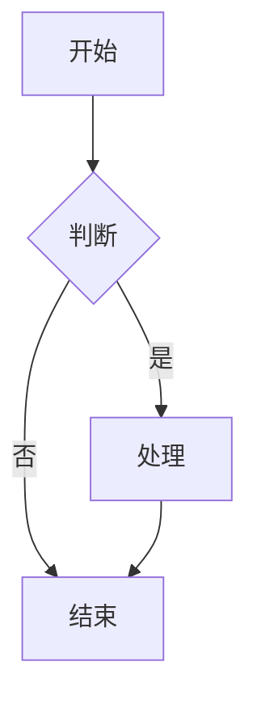
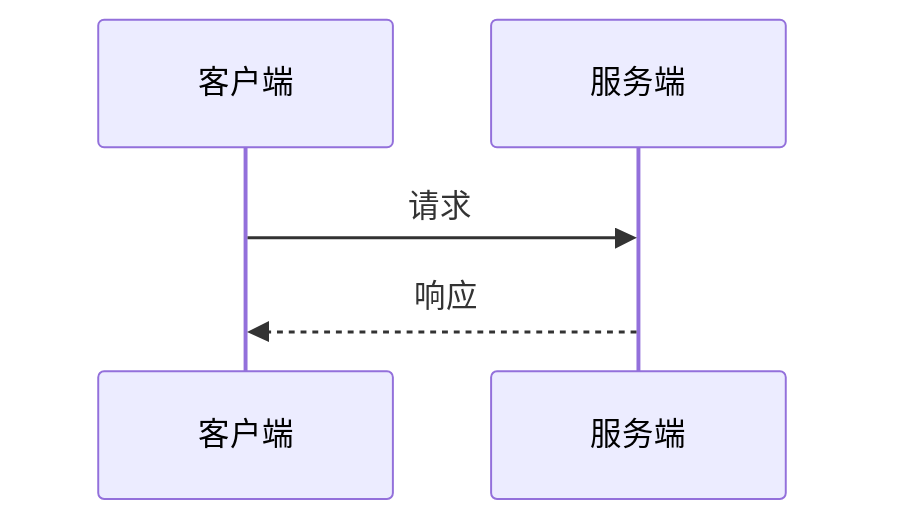
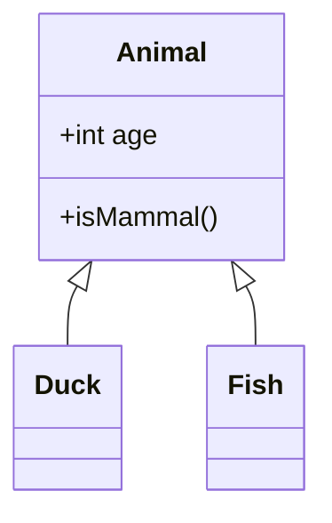
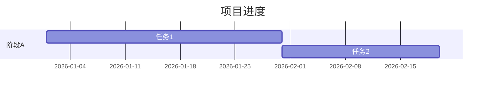
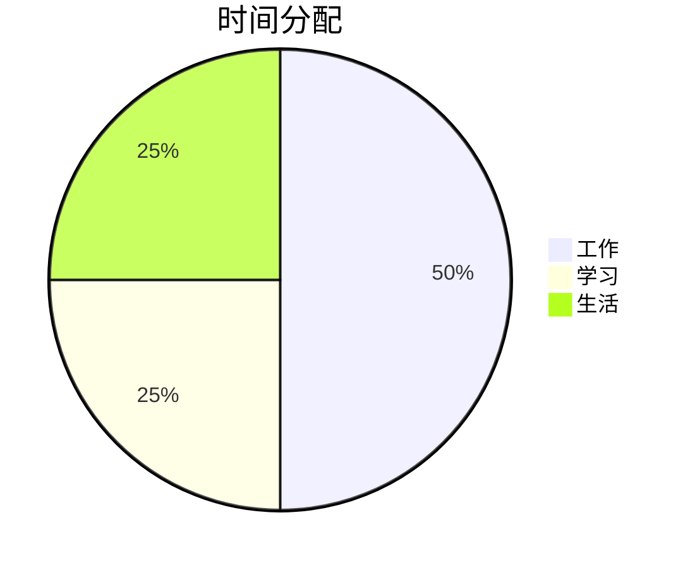

# Markdown 基础语法与 Obsidian 使用技巧

## 一、基础语法

### 1.1 标题

```markdown
# H1（一级标题）
## H2（二级标题）
### H3（三级标题）
#### H4（四级标题）
##### H5（五级标题）
###### H6（六级标题）
```

### 1.2 强调

```markdown
*斜体* 或 _斜体_
**粗体** 或 __粗体__
***粗斜体***
~~删除线~~
==高亮==（Obsidian/GFM 支持）
```

### 1.3 列表

**无序列表：**
```markdown
- 项目一
- 项目二
  - 子项目（缩进 2 空格）
  - 子项目
```

**有序列表：**
```markdown
1. 第一项
2. 第二项
   1. 子项（缩进 3 空格）
   2. 子项
```

**任务列表：**
```markdown
- [x] 已完成任务
- [ ] 未完成任务
- [ ] 待办事项
```

### 1.4 链接与图片

```markdown
[显示文本](https://example.com)
[带标题的链接](https://example.com "悬停提示")
<https://自动链接.com>


```

### 1.5 引用（Blockquote）

```markdown
> 一级引用
>> 二级引用（嵌套）
> > 也是嵌套
>
> 空行分割保持同一引用
> **引用内可用加粗等其他语法**
```

### 1.6 代码

```markdown
行内代码：`code`

代码块（围栏式）：
\`\`\`语言名
代码内容
\`\`\`
```

### 1.7 分割线

```markdown
---
***
___
```

### 1.8 转义字符

用反斜杠 `\` 转义 Markdown 特殊字符：

```markdown
\* 星号
\# 井号
\- 减号
\_ 下划线
\` 反引号
```

---

## 二、Obsidian 特有语法

### 2.1 内部链接（Wiki 链接）

```markdown
[[笔记名]]
[[笔记名|显示别名]]
[[笔记名#标题]]          → 链接到具体标题
[[笔记名#^块ID]]         → 链接到具体块
[[笔记名|自定义显示文字]]
```

### 2.2 嵌入内容（Embed）

```markdown
![[笔记名]]             → 嵌入整篇笔记
![[笔记名#标题]]        → 嵌入指定标题内容
![[笔记名#^块ID]]       → 嵌入指定块
![[图片.png]]           → 显示图片
![[文件.pdf]]           → 嵌入 PDF
```

### 2.3 标签

```markdown
#标签名
#标签/子标签           → 嵌套标签（Obsidian 特有）
#标签/子标签/子子标签
```

在 YAML Frontmatter 中：
```yaml
tags: [标签1, 标签2]
```

### 2.4 Callout（强调块）

```markdown
> [!note] 标题（可选）
> 内容

> [!info]
> 信息提示

> [!tip] 小贴士
> 提示内容

> [!warning]
> 警告内容

> [!danger]
> 危险/错误提示

> [!success] 或 [!check] 或 [!done]
> 成功提示

> [!question] 或 [!help] 或 [!faq]
> 问题提示

> [!bug]
> Bug 记录

> [!example]
> 示例

> [!quote] 或 [!cite]
> 引用
```

**Callout 可折叠：**
```markdown
> [!faq]- 可折叠 Callout（减号默认折叠）
> 点击展开内容

> [!faq]+ 可折叠 Callout（加号默认展开）
> 内容可见
```

### 2.5 注释（Comment）

```markdown
%%这是注释，仅在编辑模式可见%%
```

### 2.6 块引用与块 ID

```markdown
这是段落内容。
^块ID（放在段落任意位置或末尾）
```

### 2.7 属性（Properties）

```markdown
---
key: value
key2: [值1, 值2]
key3: >
  多行文本
---
```

Dataview 样式的内联属性：
```markdown
[类型:: 笔记]
[状态:: 进行中]
```

---

## 三、扩展语法（GFM / Obsidian 支持）

### 3.1 表格

```markdown
| 左对齐 | 居中 | 右对齐 |
| :--- | :---: | ---: |
| 单元格 | 单元格 | 单元格 |
| 单元格 | 单元格 | 单元格 |
```

### 3.2 脚注

```markdown
这是一个脚注示例[^1]。

[^1]: 脚注内容写在这里。
```

### 3.3 上标与下标

```markdown
上标：X^2^（Obsidian 语法）
下标：H~2~O（Obsidian 语法）
```

HTML 标准写法（通用）：
```html
上标：X<sup>2</sup>
下标：H<sub>2</sub>O
```

### 3.4 定义列表

```markdown
术语一
: 定义内容

术语二
: 定义内容行一
: 定义内容行二
```

### 3.5 自动链接

```markdown
www.example.com         → 自动转为链接
user@example.com        → 自动转为邮箱链接
```

---

## 四、数学公式（LaTeX）

### 4.1 行内公式

```latex
$E = mc^2$

$\sum_{i=1}^n i = \frac{n(n+1)}{2}$
```

### 4.2 块级公式

```latex
$$
\int_{a}^{b} f(x) \, dx = F(b) - F(a)
$$

$$
\begin{pmatrix}
a & b \\
c & d
\end{pmatrix}
$$
```

### 4.3 常用符号速查

| 符号 | LaTeX 代码 |
| :--- | :--- |
| $\alpha$ | `\alpha` |
| $\beta$ | `\beta` |
| $\theta$ | `\theta` |
| $\infty$ | `\infty` |
| $\partial$ | `\partial` |
| $\nabla$ | `\nabla` |
| $\sum$ | `\sum` |
| $\prod$ | `\prod` |
| $\int$ | `\int` |
| $\to$ | `\to` |
| $\Rightarrow$ | `\Rightarrow` |
| $\forall$ | `\forall` |
| $\exists$ | `\exists` |
| $\in$ | `\in` |
| $\subset$ | `\subset` |

---

## 五、Mermaid 图表

Obsidian 原生支持 Mermaid 图表渲染。

### 5.1 流程图



### 5.2 时序图



### 5.3 类图



### 5.4 甘特图



### 5.5 饼图



---

## 六、高级排版技巧

### 6.1 文本对齐

```html
<p align="center">居中文本</p>
<p align="right">右对齐文本</p>
<p align="left">左对齐文本</p>
```

### 6.2 颜色文字

```html
<span style="color: red">红色文字</span>
<span style="color: #00ff00">绿色文字</span>
<font color="blue">蓝色文字</font>
```

> ⚠️ 颜色文字在 Obsidian 阅读模式下需要 CSS 片段支持。

### 6.3 折叠内容

```html
<details>
<summary>点击展开</summary>
这里是折叠内容。
支持 **Markdown** 语法。
</details>
```

### 6.4 多列布局（需 CSS 片段）

```html
<div style="display: flex;">
  <div style="flex: 1; margin-right: 10px;">
    <!-- 左列内容 -->
  </div>
  <div style="flex: 1; margin-left: 10px;">
    <!-- 右列内容 -->
  </div>
</div>
```

### 6.5 嵌入网页（Iframe，阅读模式有效）

```html
<iframe src="https://example.com"></iframe>
<iframe src="https://www.youtube.com/embed/视频ID"></iframe>
```

---

## 七、Obsidian 实用技巧

### 7.1 快速跳转

- `[[` 触发笔记搜索
- `#` 触发标题搜索
- `@` 触发标签搜索
- `^` 触发块搜索
- `Ctrl+O`（Cmd+O）快速打开文件

### 7.2 模板

创建模板文件到 `10_Templates/`，插入时使用：

```
快捷键：Ctrl+Shift+T（或 Cmd+Shift+T）
或在命令面板搜索"插入模板"
```

模板内可用日期变量：
```markdown
{{date}}              → 当前日期
{{time}}              → 当前时间
{{date:YYYY-MM-DD}}   → 自定义日期格式
{{time:HH:mm}}        → 自定义时间格式
{{title}}             → 笔记标题
```

### 7.3 Dataview 查询

```dataview
TABLE file.ctime AS 创建时间, file.mtime AS 修改时间
FROM "文件夹路径"
WHERE contains(tags, "标签名")
SORT file.ctime DESC
```

**Dataview 常用字段：**

| 字段 | 说明 |
| :--- | :--- |
| `file.name` | 文件名 |
| `file.ctime` | 创建时间 |
| `file.mtime` | 修改时间 |
| `file.tags` | 标签数组 |
| `file.etags` | 显式标签 |
| `file.lists` | 列表项 |
| `file.tasks` | 任务项 |
| `file.frontmatter` | YAML 属性对象 |
| `file.outlinks` | 出链 |
| `file.inlinks` | 入链 |
| `file.folder` | 所在文件夹 |

### 7.4 快捷键速查

| 操作 | Windows | macOS |
| :--- | :--- | :--- |
| 创建笔记 | `Ctrl+N` | `Cmd+N` |
| 快速切换 | `Ctrl+O` | `Cmd+O` |
| 搜索 | `Ctrl+Shift+F` | `Cmd+Shift+F` |
| 命令面板 | `Ctrl+P` | `Cmd+P` |
| 插入模板 | `Ctrl+Shift+T` | `Cmd+Shift+T` |
| 粗体 | `Ctrl+B` | `Cmd+B` |
| 斜体 | `Ctrl+I` | `Cmd+I` |
| 代码块 | 选中后 `` Ctrl+` `` | 选中后 `` Cmd+` `` |
| 任务列表 | `Ctrl+Shift+Enter` | `Cmd+Shift+Enter` |
| 打开链接 | `Ctrl+Click` | `Cmd+Click` |
| 预览切换 | `Ctrl+E` | `Cmd+E` |
| 分屏 | `Ctrl+/` | `Cmd+/` |
| 源码模式 | `Ctrl+Shift+I` | `Cmd+Shift+I` |

### 7.5 实用 Setting 推荐

- **Editor → Spell check**: 开启拼写检查
- **Editor → Vim key bindings**: Vim 党福音
- **Files & Links → Default location for new notes**: 设置新建笔记默认路径
- **Files & Links → Automatically update internal links**: 重命名时自动更新链接
- **Core plugins → Templates**: 开启模板功能并设置模板文件夹路径
- **Hotkeys**: 可自定义任何操作的快捷键

---

## 八、规范与最佳实践

### 8.1 文件命名规范

```
01.20260101.描述性名称.md
```

- `01`：顺序号
- `20260101`：日期
- `描述性名称`：简短描述

### 8.2 YAML Frontmatter 推荐结构

```yaml
---
date: 2026-01-01
tags: [标签1, 标签2]
status: 进行中  # 待整理/进行中/已完成
---
```

### 8.3 写作建议

- **标题层级不超过三级**：`#` → `##` → `###`
- **全文前后空行保持段落感**：标题前空行，段落间空行
- **列表同级缩进一致**：无序列表用 `-`，有序列表用 `1.`
- **表格表头添加对齐标记**：清晰美观
- **代码块标注语言**：语法高亮自动生效
- **图片和附件统一管理**：放在 `assets/` 文件夹

---

> 📌 **持续更新中** — Markdown 和 Obsidian 生态在不断演进，保持关注更新。
